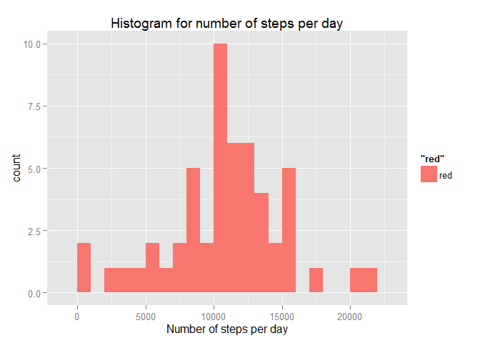
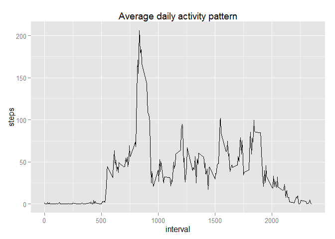
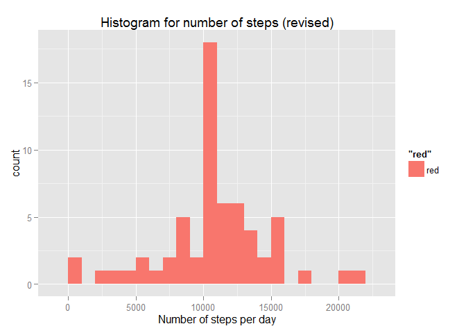
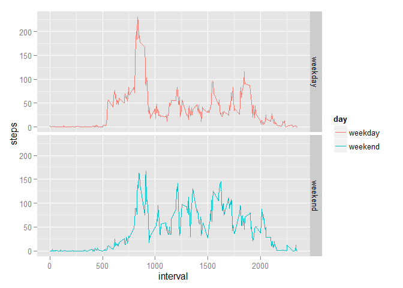

# Reproducible Research: Peer Assessment 1


## Loading and preprocessing the data
The activity.zip file that is bundled in this repository contains a single csv file named `activity.csv`. Before doing anything, we must first extract the zip file and then read it.


```r
# This extracts the file into the same directory (the directory of the repo in this case)
unzip('activity.zip')

data <- read.csv('activity.csv')
head(data)
```

```
##   steps       date interval
## 1    NA 2012-10-01        0
## 2    NA 2012-10-01        5
## 3    NA 2012-10-01       10
## 4    NA 2012-10-01       15
## 5    NA 2012-10-01       20
## 6    NA 2012-10-01       25
```


As can be seen, there are three columns, namely `steps`, `date` and `interval`. We start by exploring them a little bit.


```r
summary(data)    
```

```
##      steps                date          interval     
##  Min.   :  0.00   2012-10-01:  288   Min.   :   0.0  
##  1st Qu.:  0.00   2012-10-02:  288   1st Qu.: 588.8  
##  Median :  0.00   2012-10-03:  288   Median :1177.5  
##  Mean   : 37.38   2012-10-04:  288   Mean   :1177.5  
##  3rd Qu.: 12.00   2012-10-05:  288   3rd Qu.:1766.2  
##  Max.   :806.00   2012-10-06:  288   Max.   :2355.0  
##  NA's   :2304     (Other)   :15840
```


While the `steps` field and the `interval` field are of type **integer**, `date` field is clearly of type **factor** (as shown by the above output). Before continuing, it's best to convert the `date` field into a **Date** class.


```r
data$date <- as.Date(as.character(data$date))
summary(data$date)
```

```
##         Min.      1st Qu.       Median         Mean      3rd Qu. 
## "2012-10-01" "2012-10-16" "2012-10-31" "2012-10-31" "2012-11-15" 
##         Max. 
## "2012-11-30"
```


With this done, we can now proceed to next steps.


## What is mean total number of steps taken per day?
Here we have to make some plots. We'll be using ggplot2 library for plotting purposes.
Also, to aggregate the number by day, we'll use the `aggregate` function provided by R. 


```r
library(ggplot2)

steps_per_day <- aggregate(steps~date,data=data, FUN=sum, na.rm=T)
head(steps_per_day)
```

```
##         date steps
## 1 2012-10-02   126
## 2 2012-10-03 11352
## 3 2012-10-04 12116
## 4 2012-10-05 13294
## 5 2012-10-06 15420
## 6 2012-10-07 11015
```

As the output shows, the aggregated data has two columns, the `date` and the `steps`. While the `date` column contains the date associated with the data, the `steps` column contains the total number of steps taken in that date (with the NA values removed). We'll now plot this data using the ggplot2's qplot function.


```r
qplot( steps_per_day$steps, fill="red", 
       xlab = "Number of steps per day", 
       main = "Histogram for number of steps per day", binwidth=1000)
```

 

In addition, the mean and median of the number of steps are


```r
old_mean <- mean(steps_per_day$steps); old_mean
```

```
## [1] 10766.19
```


```r
old_median <- median(steps_per_day$steps); old_median
```

```
## [1] 10765
```


## What is the average daily activity pattern?


Again, to average the steps in each interval across the dates, we use the `aggregate` function


```r
average_steps_interval <- aggregate(steps~interval, data=data, FUN=mean, na.rm=T)
head(average_steps_interval)
```

```
##   interval     steps
## 1        0 1.7169811
## 2        5 0.3396226
## 3       10 0.1320755
## 4       15 0.1509434
## 5       20 0.0754717
## 6       25 2.0943396
```

Using ggplot2 again, we plot a time series plot of the averaged number of steps across all days versus its corresponding interval.


```r
qplot(interval,steps, data=average_steps_interval, geom="line", main="Average daily activity pattern")
```

 

From the plot, it is apparent that the highest activity is somewhere in between the 750 and the 1000 mark. To find the exact number:


```r
max_index <- which.max(average_steps_interval$steps)

average_steps_interval[max_index, "interval"]
```

```
## [1] 835
```


## Imputing missing values

The total number of NAs in this case are


```r
# remember that data is the variable where we first read the csv file to.
na_index <- is.na(data$steps)
sum(na_index)
```

```
## [1] 2304
```

To fill the missing values, we use the average of the five minute interval scheme..

```r
# these are the intervals that correspond to the missing steps
na_intervals <- data$interval[na_index]

na_steps <- sapply(na_intervals, 
                   function(x){
                        average_steps_interval[average_steps_interval$interval == x, "steps"]
                   })
new_data <- data
new_data$steps[na_index] <- na_steps
```

Now that we've created a new data set (aptly named `new_data`), it's time to move forward with our analysis. We are now required to re-create the plots that we previously did for the original data, but this time we'll substitute the `data` variable with the `new_data` variable


```r
new_steps_per_day <- aggregate(steps~date,data=new_data, FUN=sum, na.rm=T)
qplot( new_steps_per_day$steps, fill="red", 
       xlab = "Number of steps per day", 
       main = "Histogram for number of steps (revised)", binwidth=1000)
```

 

And the mean and medians are


```r
new_mean <- mean(new_steps_per_day$steps); new_mean
```

```
## [1] 10766.19
```


```r
new_median <- median(new_steps_per_day$steps); new_median
```

```
## [1] 10766.19
```

The old means and medians were `10766.19` and `10765` while the new mean and medians are `10766.19` and `10766.19`. This shows that there isn't any remarkable difference at all on the mean and median of the data after imputing the missing NA values.


## Are there differences in activity patterns between weekdays and weekends?

Using the `weekday()` function, we create a new factor variable in the newly filled dataset


```r
day <- weekdays(new_data$date)
day <- sapply(day, function(d){
    if (d %in% c("Saturday", "Sunday")){
        "weekend"
    } else{
        "weekday"
    }
})
new_data$day <- day
head(new_data)
```

```
##       steps       date interval     day
## 1 1.7169811 2012-10-01        0 weekday
## 2 0.3396226 2012-10-01        5 weekday
## 3 0.1320755 2012-10-01       10 weekday
## 4 0.1509434 2012-10-01       15 weekday
## 5 0.0754717 2012-10-01       20 weekday
## 6 2.0943396 2012-10-01       25 weekday
```

After creating this new field, we now aggregate the steps but this time we use two variables i.e. `interval` and the `day` (which contains `weekday` or `weekend`).


```r
new_average_steps_interval <- aggregate(steps~interval+day, data=new_data, FUN=mean, na.rm=T)
ggplot(new_average_steps_interval, aes(interval, steps, color=day)) + geom_line() + facet_grid(day ~ .)
```

 

